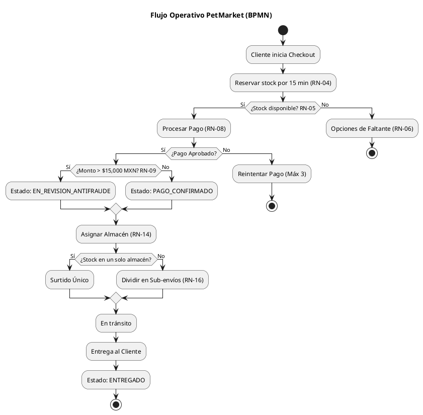

# Proceso de Negocio Integrado (BPMN)

```plantuml
@startuml
title Flujo Operativo PetMarket (BPMN)

start
:Cliente inicia Checkout;
:Reservar stock por 15 min (RN-04);

if (¿Stock disponible? RN-05) then (Sí)
  :Procesar Pago (RN-08);
  if (¿Pago Aprobado?) then (Sí)
    if (¿Monto > $15,000 MXN? RN-09) then (Sí)
      :Estado: EN_REVISION_ANTIFRAUDE;
    else (No)
      :Estado: PAGO_CONFIRMADO;
    endif
    
    :Asignar Almacén (RN-14);
    if (¿Stock en un solo almacén?) then (Sí)
      :Surtido Único;
    else (No)
      :Dividir en Sub-envíos (RN-16);
    endif
    
    :En tránsito;
    :Entrega al Cliente;
    :Estado: ENTREGADO;
    stop
  else (No)
    :Reintentar Pago (Máx 3);
    stop
  endif
else (No)
  :Opciones de Faltante (RN-06);
  stop
endif
@enduml
```
