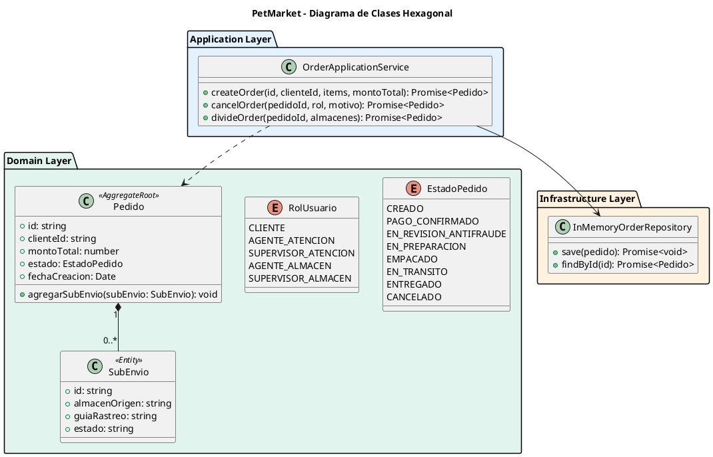

# Diagramas UML de Arquitectura - PetMarket

```plantuml
@startuml
title PetMarket - Diagrama de Clases Hexagonal

package "Domain Layer" #E1F5EE {
  enum EstadoPedido {
    CREADO
    PAGO_CONFIRMADO
    EN_REVISION_ANTIFRAUDE
    EN_PREPARACION
    EMPACADO
    EN_TRANSITO
    ENTREGADO
    CANCELADO
  }

  enum RolUsuario {
    CLIENTE
    AGENTE_ATENCION
    SUPERVISOR_ATENCION
    AGENTE_ALMACEN
    SUPERVISOR_ALMACEN
  }

  class Pedido <<AggregateRoot>> {
    +id: string
    +clienteId: string
    +montoTotal: number
    +estado: EstadoPedido
    +fechaCreacion: Date
    +agregarSubEnvio(subEnvio: SubEnvio): void
  }

  class SubEnvio <<Entity>> {
    +id: string
    +almacenOrigen: string
    +guiaRastreo: string
    +estado: string
  }

  Pedido "1" *-- "0..*" SubEnvio
}

package "Application Layer" #E3F2FD {
  class OrderApplicationService {
    +createOrder(id, clienteId, items, montoTotal): Promise<Pedido>
    +cancelOrder(pedidoId, rol, motivo): Promise<Pedido>
    +divideOrder(pedidoId, almacenes): Promise<Pedido>
  }
}

package "Infrastructure Layer" #FFF3E0 {
  class InMemoryOrderRepository {
    +save(pedido): Promise<void>
    +findById(id): Promise<Pedido>
  }
}

OrderApplicationService --> InMemoryOrderRepository
OrderApplicationService ..> Pedido
@enduml
```
