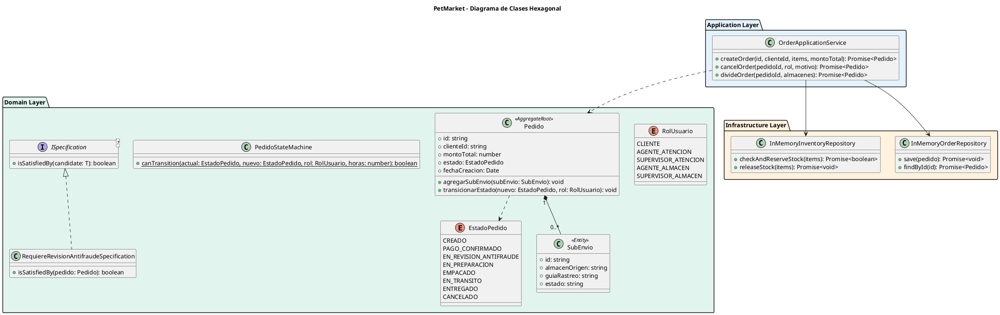
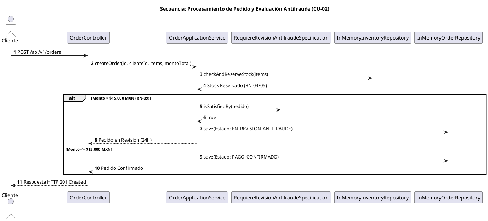

# Diagramas UML de Arquitectura - PetMarket

## 1. Diagrama de Clases (Dominio, Aplicación e Infraestructura)

```plantuml
@startuml
title PetMarket - Diagrama de Clases Hexagonal

package "Domain Layer" #E1F5EE {
  enum EstadoPedido {
    CREADO
    PAGO_CONFIRMADO
    EN_REVISION_ANTIFRAUDE
    EN_PREPARACION
    EMPACADO
    EN_TRANSITO
    ENTREGADO
    CANCELADO
  }

  enum RolUsuario {
    CLIENTE
    AGENTE_ATENCION
    SUPERVISOR_ATENCION
    AGENTE_ALMACEN
    SUPERVISOR_ALMACEN
  }

  class Pedido <<AggregateRoot>> {
    +id: string
    +clienteId: string
    +montoTotal: number
    +estado: EstadoPedido
    +fechaCreacion: Date
    +agregarSubEnvio(subEnvio: SubEnvio): void
    +transicionarEstado(nuevo: EstadoPedido, rol: RolUsuario): void
  }

  class SubEnvio <<Entity>> {
    +id: string
    +almacenOrigen: string
    +guiaRastreo: string
    +estado: string
  }

  class PedidoStateMachine {
    +{static} canTransition(actual: EstadoPedido, nuevo: EstadoPedido, rol: RolUsuario, horas: number): boolean
  }

  interface ISpecification<T> {
    +isSatisfiedBy(candidate: T): boolean
  }

  class RequiereRevisionAntifraudeSpecification implements ISpecification {
    +isSatisfiedBy(pedido: Pedido): boolean
  }

  Pedido "1" *-- "0..*" SubEnvio
  Pedido ..> EstadoPedido
}

package "Application Layer" #E3F2FD {
  class OrderApplicationService {
    +createOrder(id, clienteId, items, montoTotal): Promise<Pedido>
    +cancelOrder(pedidoId, rol, motivo): Promise<Pedido>
    +divideOrder(pedidoId, almacenes): Promise<Pedido>
  }
}

package "Infrastructure Layer" #FFF3E0 {
  class InMemoryOrderRepository {
    +save(pedido): Promise<void>
    +findById(id): Promise<Pedido>
  }
  class InMemoryInventoryRepository {
    +checkAndReserveStock(items): Promise<boolean>
    +releaseStock(items): Promise<void>
  }
}

OrderApplicationService --> InMemoryOrderRepository
OrderApplicationService --> InMemoryInventoryRepository
OrderApplicationService ..> Pedido
@enduml
```

## 2. Diagrama de Secuencia (Confirmación de Pago y Antifraude)

```plantuml
@startuml
title Secuencia: Procesamiento de Pedido y Evaluación Antifraude (CU-02)

autonumber
actor Cliente
participant OrderController as Controller
participant OrderApplicationService as Service
participant RequiereRevisionAntifraudeSpecification as FraudSpec
participant InMemoryInventoryRepository as InvRepo
participant InMemoryOrderRepository as OrderRepo

Cliente -> Controller: POST /api/v1/orders
Controller -> Service: createOrder(id, clienteId, items, montoTotal)
Service -> InvRepo: checkAndReserveStock(items)
InvRepo --> Service: Stock Reservado (RN-04/05)

alt Monto > $15,000 MXN (RN-09)
  Service -> FraudSpec: isSatisfiedBy(pedido)
  FraudSpec --> Service: true
  Service -> OrderRepo: save(Estado: EN_REVISION_ANTIFRAUDE)
  Service --> Controller: Pedido en Revisión (24h)
else Monto <= $15,000 MXN
  Service -> OrderRepo: save(Estado: PAGO_CONFIRMADO)
  Service --> Controller: Pedido Confirmado
end

Controller --> Cliente: Respuesta HTTP 201 Created
@enduml
```
